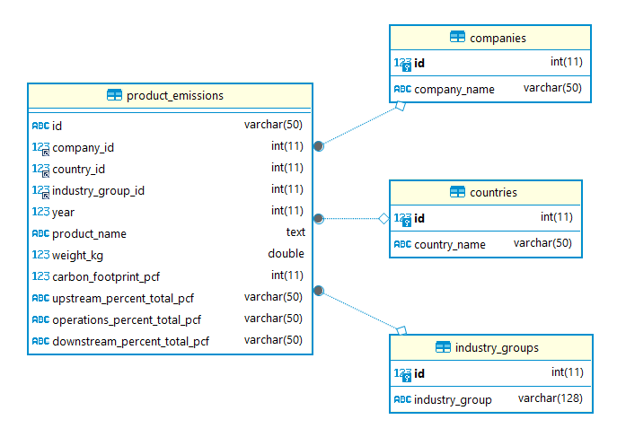
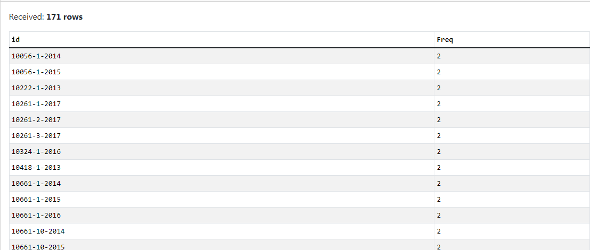

# Carbon-Emission-Analysis

## 1. Abstract
This project explores product carbon footprints (PCFs) to understand how different products affect the environment. The main goal is to analyze carbon emissions to examine the carbon footprint across various industries. I aim to identify sectors with the highest levels of emissions by analyzing them across countries and years, as well as to uncover trends.

## 2. Data source
The dataset is compiled from publicly available data from nature.com and encompasses the product carbon footprints (PCF) for various companies. PCFs represent the greenhouse gas emissions associated with specific products, quantified in CO2 (carbon dioxide equivalent). And here is the data structure of the dataset:



The dataset has four tables containing information of carbon emission released during the the companies production.

## 3. Methodology
### 1) Extracting and cleaning data
Before analyzing, I must clean the data first. Specifically as follows:
#### a. Finding duplicated records
Duplicate entries are identified using a COUNT(1) > 1 query in SQL. This approach groups records by key identifiers to check for rows with the same values, which could distort the accuracy of carbon emission calculations.
```sql
SELECT id, count(id) as Freq
FROM product_emissions
GROUP BY id
having count(id) > 1
```
The result:


There are 171 duplicated records in total.
