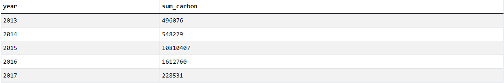

# Carbon-Emission-Analysis

## 1. Abstract
This project explores product carbon footprints (PCFs) to understand how different products affect the environment. The main goal is to analyze carbon emissions to examine the carbon footprint across various industries. I aim to identify sectors with the highest levels of emissions by analyzing them across countries and years, as well as to uncover trends.

## 2. Data source
The dataset is compiled from publicly available data from nature.com and encompasses the product carbon footprints (PCF) for various companies. PCFs represent the greenhouse gas emissions associated with specific products, quantified in CO2 (carbon dioxide equivalent). And here is the data structure of the dataset:


The dataset has four tables containing information of carbon emission released during the the companies production.

## 3. Methodology
I used **SQL** to query the information needed for analysis purposes throughout this project. But before analyzing, I must check the dataset first. Duplicate entries are identified using a COUNT(id) > 1 query in SQL. This approach groups records by key identifiers to check for rows with the same values, which could distort the accuracy of carbon emission calculations.
```sql
SELECT id, count(id) as Freq
FROM product_emissions
GROUP BY id
having count(id) > 1
```
The result:


We can see that the id values ​​are repeated twice. It is strange because the id column must be unique. So let's check all the remaining columns to see if there are any duplicates by this code:
```sql
SELECT *
FROM product_emissions
WHERE id = '10056-1-2014' # I will test with the first id in the above result first
```
| id           | company_id | country_id | industry_group_id | year | product_name             | weight_kg | carbon_footprint_pcf | upstream_percent_total_pcf | operations_percent_total_pcf | downstream_percent_total_pcf | 
| -----------: | ---------: | ---------: | ----------------: | ---: | -----------------------: | --------: | -------------------: | -------------------------: | ---------------------------: | ---------------------------: | 
| 10056-1-2014 | 82         | 28         | 2                 | 2014 | Frosted Flakes(R) Cereal | 0.7485    | 2                    | 57.50                      | 30.00                        | 12.50                        | 
| 10056-1-2014 | 82         | 28         | 2                 | 2014 | Frosted Flakes(R) Cereal | 0.7485    | 2                    | 57.50                      | 30.00                        | 12.50                        | 

We can see that these records are identical, we can do the same check with the remaining duplicate ids, the result still gives completely duplicate records like that. Thus, if we do not filter them before calculating, the result would be nonsense.

## 4. Finding insights
### 1. Which product emits the most carbon ?
```sql
SELECT product_name, sum(carbon_footprint_pcf) as sum_carbon
FROM (
  SELECT DISTINCT * # Use SELECT DISTINCT * to remove the duplicated records
	FROM product_emissions
) AS cleaned_data
GROUP BY product_name
ORDER BY sum_carbon DESC
```
In this code, I used subquery to filter the duplications before calculating the sum of carbon footprint. And here is the result:


**Wind Turbine G128 5 Megawats** is top 1 in this category, with **3718044** of carbon footprint.

### 2. Which industry group does carbon-intensive products belong to ?
```sql
SELECT i.industry_group, p.product_name
FROM (
  		SELECT DISTINCT *
  		FROM product_emissions
  ) AS p
LEFT JOIN industry_groups i on p.industry_group_id = i.id
WHERE product_name = 'Wind Turbine G128 5 Megawats'
```


### 3. The industries with the highest contribution to carbon emissions
```sql
SELECT i.industry_group, sum(c.carbon_footprint_pcf) as sum_carbon
FROM (
  		SELECT DISTINCT *
  		FROM product_emissions
  ) AS c # Use subquery to filter the duplicated records first
LEFT JOIN industry_groups i on c.industry_group_id = i.id
GROUP BY i.industry_group
ORDER BY sum_carbon DESC
LIMIT 1
```


### 4. The companies with the highest contribution to carbon emissions
```sql
SELECT c.company_name, sum(a.carbon_footprint_pcf) as sum_carbon
FROM (
  		SELECT DISTINCT *
  		FROM product_emissions
  ) AS a
LEFT JOIN companies c on a.company_id = c.id
GROUP BY c.company_name
ORDER BY sum_carbon DESC
LIMIT 1
```


### 5. The countries with the highest contribution to carbon emissions
```sql
SELECT c.country_name, sum(a.carbon_footprint_pcf) as sum_carbon
FROM (
  		SELECT DISTINCT *
  		FROM product_emissions
  ) AS a
LEFT JOIN countries c on a.country_id = c.id
GROUP BY c.country_name
ORDER BY sum_carbon DESC
LIMIT 1
```


### 6. The trend of carbon footprints (PCFs) over the years
```sql
SELECT year, sum(carbon_footprint_pcf) as sum_carbon
FROM (
  		SELECT DISTINCT *
  		FROM product_emissions
  ) AS clean_data
GROUP BY year
ORDER BY year
```


In general, carbon emissions have been increasing year by year since **2013** and peaked at **1612760** in **2016**. But then dropped dramatically to **228531** in **2017**. This shows that people have become more aware of the harmful effects that CO2 emissions have brought, such as climate change, air pollution, melting ice at the two poles causing rising sea levels, etc. 

## 5. Actionable insights
There are top 5 industries with the highest of CO2 emissions into the environment:
| industry_group                     | sum_carbon | 
| ---------------------------------: | ---------: | 
| Electrical Equipment and Machinery | 9801558    | 
| Automobiles & Components           | 2582264    | 
| Materials                          | 430199     | 
| Technology Hardware & Equipment    | 278650     | 
| Capital Goods                      | 258633     | 

I will focus on each industry to give some actionable insights:
- Electrical Equiment and Machinery:
  - Encourage businesses to switch to use renewable energy in production.
  - Increase energy efficiency of machinery, apply energy-saving technology.
  - Issue policies to support research and application green technology in the production of electrical equiment.
- Automobile & Components:
  - Boosting the production and use of electric vehicles to replace gasoline-powered vehicles.
  - Apply carbon tax policies to high-emission vehicles.
  - Strengthen the development of green public transport system such as electric buses and electric trains.
- Materials:
  - Use environmentally friendly materials in construction, such as green concrete and recycled steel.
  - Develop production technologies that reduce CO2 emissions, such as using renewable energy in smelters.
  - Recycle building materials to reduce the demand for new production.
- Technology Hardward & Equipment:
  - Design low-energy technology equipment, optimize performance.
  - Encourage recycling of electronic components, reduce exploitation of natural resources.
  - Use eco-friendly materials in component production.
- Capital Goods:
  - Require businesses to report CO2 emissions from manufacturing machinery.
  - Provide tax incentives for businesses to switch to cleaner production technologies.
  - Encourage the use of robots and automation to reduce energy waste in manufacturing.

