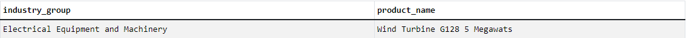

# Carbon-Emission-Analysis

## 1. Abstract
This project explores product carbon footprints (PCFs) to understand how different products affect the environment. The main goal is to analyze carbon emissions to examine the carbon footprint across various industries. I aim to identify sectors with the highest levels of emissions by analyzing them across countries and years, as well as to uncover trends.

## 2. Data source
The dataset is compiled from publicly available data from nature.com and encompasses the product carbon footprints (PCF) for various companies. PCFs represent the greenhouse gas emissions associated with specific products, quantified in CO2 (carbon dioxide equivalent). And here is the data structure of the dataset:


The dataset has four tables containing information of carbon emission released during the the companies production.

## 3. Methodology
Before analyzing, I must check the dataset first. Duplicate entries are identified using a COUNT(1) > 1 query in SQL. This approach groups records by key identifiers to check for rows with the same values, which could distort the accuracy of carbon emission calculations.
```sql
SELECT id, count(id) as Freq
FROM product_emissions
GROUP BY id
having count(id) > 1
```
The result:


There are 171 duplicated records in total. These rows must be filtered before analyzing anything. Let's discuss it in the next section.

## 4. Finding insights
### 1. Which product emits the most carbon ?
```sql
SELECT product_name, sum(carbon_footprint_pcf) as sum_carbon
FROM (
  SELECT DISTINCT * # Use SELECT DISTINCT * to remove the duplicated records
	FROM product_emissions
) AS cleaned_data
GROUP BY product_name
ORDER BY sum_carbon DESC
```
In this code, I used subquery to filter the duplications before calculating the sum of carbon footprint. And here is the result:


**Wind Turbine G128 5 Megawats** is top 1 in this category, with **3718044** of carbon footprint.

### 2. Which industry group does carbon-intensive products belong to ?
```sql
SELECT distinct p.id, i.industry_group, p.product_name
FROM product_emissions p
LEFT JOIN industry_groups i on p.industry_group_id = i.id
WHERE product_name = 'Wind Turbine G128 5 Megawats'
```


### 3. The industries with the highest contribution to carbon emissions
```sql
SELECT i.industry_group, sum(c.carbon_footprint_pcf) as sum_carbon
FROM (
  		SELECT DISTINCT *
  		FROM product_emissions
  ) AS c # Use subquery to filter the duplicated records first
LEFT JOIN industry_groups i on c.industry_group_id = i.id
GROUP BY i.industry_group
ORDER BY sum_carbon DESC
LIMIT 1
```


### 4. The companies with the highest contribution to carbon emissions
```sql
SELECT c.company_name, sum(a.carbon_footprint_pcf) as sum_carbon
FROM (
  		SELECT DISTINCT *
  		FROM product_emissions
  ) AS a
LEFT JOIN companies c on a.company_id = c.id
GROUP BY c.company_name
ORDER BY sum_carbon DESC
LIMIT 1
```


### 5. The countries with the highest contribution to carbon emissions
```sql
SELECT c.country_name, sum(a.carbon_footprint_pcf) as sum_carbon
FROM (
  		SELECT DISTINCT *
  		FROM product_emissions
  ) AS a
LEFT JOIN countries c on a.country_id = c.id
GROUP BY c.country_name
ORDER BY sum_carbon DESC
LIMIT 1
```


### 6. The trend of carbon footprints (PCFs) over the years
```sql
